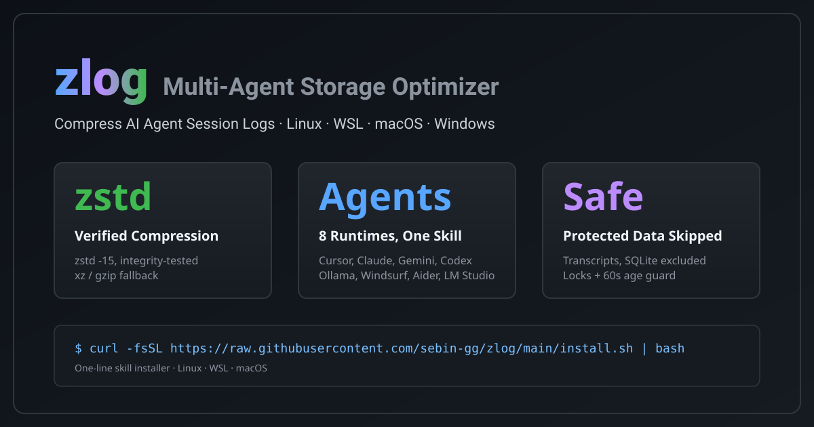

# zlog — Multi-Agent Session Log Storage Optimizer



[](https://agentskills.io)
[](https://skills.sh)
[](https://github.com/sebin-gg/zlog/actions)
[](LICENSE)
[](#compatibility)

> **Compresses background tool logs across 15+ AI agent runtimes to save ~77% SSD space (4.3x compression ratio) while keeping conversation transcripts 100% readable.**

---

## 📊 Before vs. After Benchmark

| Metric | Without `zlog` (Raw Logs) | With `zlog` (Optimized) | Advantage |
| :--- | :--- | :--- | :--- |
| **Monthly Storage Bloat** | ~9.0 GB | **~2.07 GB** | **77% Disk Space Saved** |
| **Yearly Storage Bloat** | ~108 GB | **~24.8 GB** | **~83 GB SSD Space Reclaimed** |
| **Active Process Safety** | None (Risk of file corruption) | **Kernel Lock Checked (`fuser`/`lsof`)** | **Zero Process Interruption** |
| **Conversation Memory** | Risk of wiping history | **`transcript.jsonl` Untouched** | **100% AI Context Retained** |

---

## 🚀 Quick Install

### One-Line Terminal Install

```bash
curl -fsSL https://raw.githubusercontent.com/sebin-gg/zlog/main/install.sh | bash
```

### via `skills.sh` CLI

```bash
npx skills add sebin-gg/zlog
```

---

## ✨ Key Features & Pros

- ⚡ **77% Disk Space Savings**: Compresses `.log`, `.out`, `.txt`, `.trace` logs into `.gz` archives.
- 🛡️ **Context-Safe**: Keeps `transcript.jsonl` files uncompressed for AI memory continuity.
- 🔒 **Process Lock Protection**: Queries kernel locks (`fuser -s` / `lsof`) to skip active in-flight log files open by running subagents or IDE instances.
- 🔍 **Dry-Run Mode**: Preview space savings without modifying any files.
- 🎯 **Noise Filter**: Skips tiny files (<10KB) and documentation (`README*`, `LICENSE*`).
- 🌐 **Multi-Agent Preset Support**: Auto-targets Antigravity, Gemini, Cursor, Claude Code, Ollama, Aider, Continue, Windsurf, Codeium, OpenHands, Codex, and Hugging Face.

---

## 💻 CLI Execution Snippets

### POSIX Shell (Linux, macOS, WSL, Git Bash)

```bash
for d in ~/.gemini ~/.agents ~/.config/Cursor ~/.cursor ~/.ollama ~/.claude ~/.config/claude-code ~/.aider ~/.continue ~/.codeium ~/.windsurf ~/.openhands ~/.codex ~/.cache/huggingface ~/.cache/lm-studio; do
  if [ -d "$d" ]; then
    find -L "$d" \( -name "*.log" -o -name "*.out" -o -name "*.trace" -o -name "*.txt" \) -not -name "*.gz" -not -name "*.jsonl" -not -name "SKILL.md" -not -iname "README*" -not -iname "LICENSE*" -size +10k -mmin +1 -exec sh -c 'for f; do (command -v fuser >/dev/null 2>&1 && fuser -s "$f" 2>/dev/null) || (command -v lsof >/dev/null 2>&1 && lsof "$f" >/dev/null 2>&1) || gzip -f "$f"; done' sh {} + 2>/dev/null || true
    [ ! -L "$d" ] && du -sh "$d" 2>/dev/null || true
  fi
done
```

### Windows 11 Native Compression (PowerShell - .zip)

```powershell
Get-ChildItem -Path "$env:USERPROFILE\.gemini","$env:USERPROFILE\.agents","$env:USERPROFILE\.cursor","$env:USERPROFILE\.ollama","$env:USERPROFILE\.claude" -Recurse -Include *.log,*.out,*.txt,*.trace -Exclude *.gz,*.jsonl,SKILL.md,README*,LICENSE* -ErrorAction SilentlyContinue | Where-Object { $_.Length -gt 10KB -and $_.LastWriteTime -lt (Get-Date).AddMinutes(-1) } | ForEach-Object { Compress-Archive -Path $_.FullName -DestinationPath "$($_.FullName).zip" -Force; Remove-Item $_.FullName }
```

---

## 📄 License

[MIT](LICENSE) © 2026
