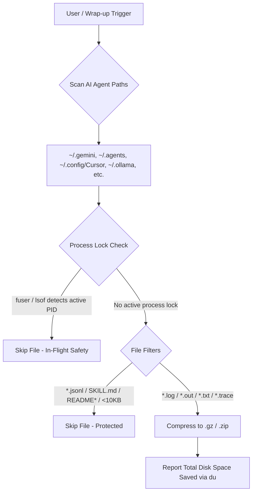

# zlog — Multi-Agent Session Log Storage Optimizer


<p align="center">
  <a href="https://agentskills.io"></a>
  <a href="https://skills.sh"></a>
  <a href="https://github.com/sebin-gg/zlog/actions"></a>
  <a href="LICENSE"></a>
  <a href="#compatibility"></a>
  <a href="https://github.com/sebin-gg/zlog/stargazers"></a>
</p>

Compress background tool logs across 15+ AI agent runtimes. Save ~77% SSD space (4.3x compression ratio). Keep conversation transcripts 100% intact.

---

## ⚡ Key Features

- **77% Disk Space Savings**: Gzip `.log`, `.out`, `.txt`, `.trace` files into `.gz` (or `.zip` on Windows).
- **Context-Safe**: Excludes `transcript.jsonl` files. Zero memory loss for AI agents.
- **Process Lock Safety**: Checks kernel locks via `fuser -s` (Linux/WSL) or `lsof` (macOS). Skips open files.
- **In-Flight Guard**: Skips files modified <60 seconds ago (`-mmin +1`).
- **Dry-Run Mode**: Preview space savings without touching files.
- **15+ AI Agent Presets**: Auto-targets Antigravity, Gemini, Cursor, Claude Code, Ollama, Aider, Continue, Windsurf, Codeium, OpenHands, Codex, and Hugging Face.

---

## 📊 Performance Benchmark

| Metric | Raw Logs | With `zlog` | Storage Saved |
| :--- | :--- | :--- | :--- |
| **Compression Ratio** | 1.0x | **4.3x (.gz / .zip)** | **77% SSD Space Saved** |
| **Monthly Footprint** | ~9.0 GB | **~2.07 GB** | **~6.93 GB / Month Saved** |
| **Yearly Footprint** | ~108 GB | **~24.8 GB** | **~83.2 GB / Year Saved** |

---

## 🚀 Installation

### One-Line Install

```bash
curl -fsSL https://raw.githubusercontent.com/sebin-gg/zlog/main/install.sh | bash
```

### `skills.sh` CLI

```bash
npx skills add sebin-gg/zlog
```

---

## 🏗️ Architecture



---

## 🌐 Supported AI Agent Runtimes

| AI Agent / IDE | Default Path | OS Support |
| :--- | :--- | :--- |
| **Antigravity CLI** | `~/.gemini/antigravity-cli/logs/` | Linux, macOS, Windows 11 |
| **Gemini CLI** | `~/.gemini/` | Linux, macOS, Windows 11 |
| **Global Agent Skills** | `~/.agents/` | Linux, macOS, Windows 11 |
| **Cursor IDE** | `~/.config/Cursor/` & `~/.cursor/` | Linux, macOS, Windows 11 |
| **Claude Code** | `~/.claude/` & `~/.config/claude-code/` | Linux, macOS, Windows 11 |
| **Ollama** | `~/.ollama/` & `~/.cache/ollama/` | Linux, macOS, Windows 11 |
| **Aider AI** | `~/.aider/` | Linux, macOS, Windows 11 |
| **Continue.dev** | `~/.continue/` | Linux, macOS, Windows 11 |
| **Windsurf / Codeium** | `~/.windsurf/` & `~/.codeium/` | Linux, macOS, Windows 11 |
| **OpenHands** | `~/.openhands/` | Linux, macOS, Windows 11 |
| **Codex CLI** | `~/.codex/` | Linux, macOS, Windows 11 |
| **LM Studio & Hugging Face** | `~/.cache/lm-studio/` & `~/.cache/huggingface/` | Linux, macOS, Windows 11 |

---

## 💻 CLI Snippets

### POSIX Shell (Linux, macOS, WSL, Git Bash)

```bash
for d in ~/.gemini ~/.agents ~/.config/Cursor ~/.cursor ~/.ollama ~/.claude ~/.config/claude-code ~/.aider ~/.continue ~/.codeium ~/.windsurf ~/.openhands ~/.codex ~/.cache/huggingface ~/.cache/lm-studio; do
  if [ -d "$d" ]; then
    find -L "$d" \( -name "*.log" -o -name "*.out" -o -name "*.trace" -o -name "*.txt" \) -not -name "*.gz" -not -name "*.jsonl" -not -name "SKILL.md" -not -iname "README*" -not -iname "LICENSE*" -size +10k -mmin +1 -exec sh -c 'for f; do (command -v fuser >/dev/null 2>&1 && fuser -s "$f" 2>/dev/null) || (command -v lsof >/dev/null 2>&1 && lsof "$f" >/dev/null 2>&1) || gzip -f "$f"; done' sh {} + 2>/dev/null || true
    [ ! -L "$d" ] && du -sh "$d" 2>/dev/null || true
  fi
done
```

### Windows 11 Native Compression (PowerShell - .zip)

```powershell
Get-ChildItem -Path "$env:USERPROFILE\.gemini","$env:USERPROFILE\.agents","$env:USERPROFILE\.cursor","$env:USERPROFILE\.ollama","$env:USERPROFILE\.claude" -Recurse -Include *.log,*.out,*.txt,*.trace -Exclude *.gz,*.jsonl,SKILL.md,README*,LICENSE* -ErrorAction SilentlyContinue | Where-Object { $_.Length -gt 10KB -and $_.LastWriteTime -lt (Get-Date).AddMinutes(-1) } | ForEach-Object { Compress-Archive -Path $_.FullName -DestinationPath "$($_.FullName).zip" -Force; Remove-Item $_.FullName }
```

---

## ❓ FAQ

- **Break chat history?** No. `transcript.jsonl` files excluded.
- **Process safety?** `fuser -s` / `lsof` checks kernel locks. Open files skipped.
- **Read `.gz` logs?** `zcat file.log.gz` to view, `zgrep "error" file.log.gz` to search.

---

## 📄 License

[MIT](LICENSE) © 2026 Sebin Mathew
