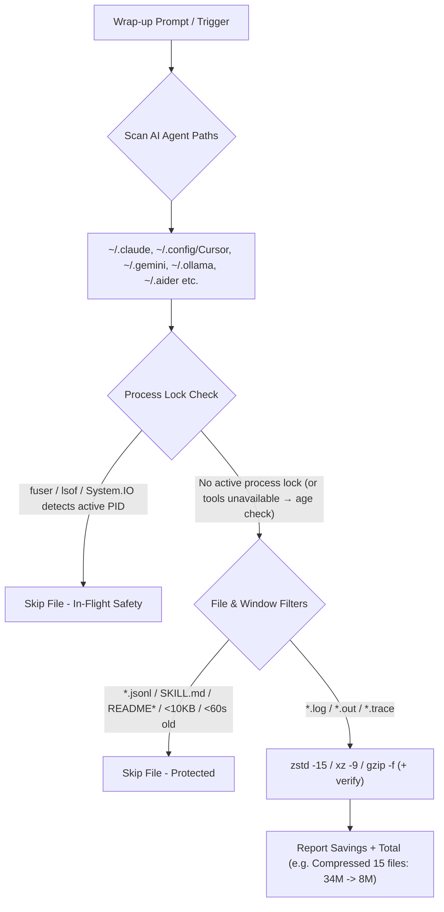

# zlog — Multi-Agent Session Log Storage Optimizer


<p align="center">
  <a href="https://agentskills.io"></a>
  <a href="https://skills.sh"></a>
  <a href="https://github.com/sebin-gg/zlog/actions"></a>
  <a href="LICENSE"></a>
  <a href="#compatibility"></a>
  <a href="https://github.com/sebin-gg/zlog/stargazers"></a>
</p>

> **The universal zero-config log compressor for AI agent developers.** Compresses session logs across Claude Code, Cursor, Gemini CLI, Ollama, Windsurf, Codex, Aider & LM Studio while keeping 100% of conversation transcripts intact. Run the Dry-Run preview for your own savings numbers.

---

## 🚀 Quick Install (1-Line)

### via `skills.sh` Package Manager
```bash
npx skills add sebin-gg/zlog
```

### via Shell Script
```bash
curl -fsSL https://raw.githubusercontent.com/sebin-gg/zlog/main/install.sh | bash
# Skill installed to ~/.agents/skills/zlog/SKILL.md — trigger in chat with: 'zlog', 'compress logs', or 'clean chat logs'.
```

> **What gets installed?** `install.sh` downloads `SKILL.md` to `~/.agents/skills/zlog/` (plus `~/.claude/skills/` / `~/.gemini/skills/` if those homes exist) so your AI agent can invoke `zlog` via chat. For terminal-only use with no install, copy the one-line snippets below.

---

## ⚡ Key Highlights

- **High-Ratio Compression**: Tries `zstd -15`, falls back to `xz -9` / `gzip`. Reports per-run savings with a single summary line.
- **0-Byte Log Purging**: Cleans dead empty files automatically.
- **Process Lock Safe (best-effort)**: Checks kernel locks via `fuser -s` (Linux/WSL) or `lsof` (macOS), and `[System.IO.File]::Open` (Windows). If neither `fuser` nor `lsof` is available (minimal containers), safety falls back to a 60s age buffer — see FAQ.
- **Memory Context Intact**: Excludes `transcript.jsonl` files. Zero context loss for AI agents.
- **Single-Line Output**: Condenses multi-folder scan results into one clean line (`253M total`).
- **Cross-Platform Parity**: Runs natively on Linux, macOS, WSL, and Windows 11 PowerShell (with savings reporting on all platforms).
- **Junk-Pruned Hybrid Deep Scan**: Never descends into `Caches`/`node_modules`/GPU-cache junk or `.git`; capped at depth 12 — fast, future-proof, bounded. Compressed artifacts are verified before counting.

---

## 📊 Storage Savings

Savings depend on log content (repetitive text compresses best). Run the Dry-Run preview for your own numbers — the skill reports per-run raw → compressed totals.

---

## 🏗️ How It Works



---

## 🌐 Supported AI Agent Runtimes

| # | AI Agent / IDE | Default Log Directory | OS Parity |
| :---: | :--- | :--- | :--- |
| 1 | **Claude Code** | `~/.claude/` | Linux, Windows 11 |
| 2 | **Claude Code Config** | `~/.config/claude-code/` | Linux, Windows 11 |
| 3 | **Cursor IDE** | `~/.config/Cursor/` | Linux, Windows 11 |
| 4 | **Cursor (Legacy)** | `~/.cursor/` | Linux, Windows 11 |
| 5 | **Gemini CLI** | `~/.gemini/` | Linux, Windows 11 |
| 6 | **Gemini Antigravity** | `~/.gemini/antigravity/` (+ `antigravity-cli/logs/`) | Linux, Windows 11 |
| 7 | **Ollama** | `~/.ollama/` | Linux, Windows 11 |
| 8 | **Windsurf** | `~/.windsurf/` | Linux, Windows 11 |
| 9 | **Codex CLI** | `~/.codex/` | Linux, Windows 11 |
| 10 | **LM Studio** | `~/.cache/lm-studio/` (older) + `~/.lmstudio/` (current) | Linux, Windows 11 |
| 11 | **Aider** | `~/.aider/` | Linux, Windows 11 |

> **Note on Antigravity:** Antigravity stores logs under `~/.gemini/antigravity/` (and `~/.gemini/antigravity-cli/logs/`) — a Gemini CLI sub-component, not a standalone top-level agent. Both are covered automatically when scanning `~/.gemini/`.

## 💻 One-Line Command Snippets

> POSIX scans never follow symlinks (`find -P` default): symlinked dirs are not descended into and symlinked files are skipped, so scans stay inside the listed roots.

### POSIX Shell (Linux, macOS, WSL, Git Bash)

```bash
raw=0; saved=0; count=0
prune=(-name node_modules -o -name Caches -o -name Cache -o -name "Code Cache" -o -name blob_storage -o -name GPUCache -o -name DawnGraphiteCache -o -name DawnWebGPUCache -o -name .git)
for d in ~/.claude ~/.config/claude-code ~/.config/Cursor ~/.cursor ~/.gemini ~/.ollama ~/.windsurf ~/.codex ~/.cache/lm-studio ~/.lmstudio ~/.aider "$HOME/Library/Application Support/Cursor" "$HOME/Library/Application Support/Windsurf" ~/.config/Windsurf "$HOME/AppData/Local/Ollama"; do
  [ -d "$d" ] || continue
  # --- purge empty logs with the same safety predicate (pruned, aged, unlocked) ---
  while IFS= read -r -d '' f; do
    [ -z "$f" ] && continue
    # --- lock check (best-effort): skip if a process holds the file ---
    locked=0
    if command -v fuser >/dev/null 2>&1 && fuser -s "$f" 2>/dev/null; then locked=1; fi
    if [ "$locked" -eq 0 ] && command -v lsof >/dev/null 2>&1 && lsof "$f" >/dev/null 2>&1; then locked=1; fi
    if [ "$locked" -eq 1 ]; then continue; fi
    rm -f "$f" 2>/dev/null || true
  done < <(find "$d" \( -type d \( "${prune[@]}" \) -prune \) -o \( -type f \( -name "*.log" -o -name "*.out" -o -name "*.trace" \) -empty -mmin +1 -print0 \) 2>/dev/null) || true
  while IFS= read -r -d '' f; do
    [ -z "$f" ] && continue
    size=$(stat -c%s "$f" 2>/dev/null || stat -f%z "$f" 2>/dev/null) || size=0
    # --- lock check (best-effort): skip if a process holds the file ---
    locked=0
    if command -v fuser >/dev/null 2>&1 && fuser -s "$f" 2>/dev/null; then locked=1; fi
    if [ "$locked" -eq 0 ] && command -v lsof >/dev/null 2>&1 && lsof "$f" >/dev/null 2>&1; then locked=1; fi
    if [ "$locked" -eq 1 ]; then continue; fi
    # --- transactional compress: temp file -> integrity test -> rename -> remove source ---
    tmp=""; ext=""; ok=0
    if command -v zstd >/dev/null 2>&1; then tmp="$f.$$.tmp.zst"; if zstd -15 -q "$f" -o "$tmp" 2>/dev/null && zstd -t -q "$tmp" 2>/dev/null; then ext=zst; ok=1; else rm -f "$tmp" 2>/dev/null; fi
    fi
    if [ "$ok" -eq 0 ] && command -v xz >/dev/null 2>&1; then tmp="$f.$$.tmp.xz"; if xz -9 -c "$f" > "$tmp" 2>/dev/null && xz -t "$tmp" 2>/dev/null; then ext=xz; ok=1; else rm -f "$tmp" 2>/dev/null; fi
    fi
    if [ "$ok" -eq 0 ]; then tmp="$f.$$.tmp.gz"; if gzip -9 -c "$f" > "$tmp" 2>/dev/null && gzip -t "$tmp" 2>/dev/null; then ext=gz; ok=1; else rm -f "$tmp" 2>/dev/null; fi
    fi
    if [ "$ok" -eq 1 ]; then
      newsize=$(stat -c%s "$tmp" 2>/dev/null || stat -f%z "$tmp" 2>/dev/null) || newsize=0
      # only replace when the archive is valid AND smaller (high-entropy files can grow)
      if [ "$newsize" -gt 0 ] && [ "$newsize" -lt "$size" ] && mv -f "$tmp" "$f.$ext" 2>/dev/null; then
        rm -f "$f" 2>/dev/null
        raw=$((raw + size)); saved=$((saved + size - newsize)); count=$((count + 1))
      else rm -f "$tmp" 2>/dev/null
      fi
    fi
  done < <(find "$d" \( -type d \( "${prune[@]}" \) -prune \) -o \( -type f \( -name "*.log" -o -name "*.out" -o -name "*.trace" \) -not -name "*.gz" -not -name "*.zst" -not -name "*.xz" -not -name "*.tmp.*" -not -name "*.jsonl" -not -name "SKILL.md" -not -iname "README*" -not -iname "LICENSE*" -size +10k -mmin +1 -print0 \) 2>/dev/null) || true
done
if [ "$count" -gt 0 ]; then
  comp=$((raw - saved))
  raw_h=$(echo "$raw" | awk '{if($1>=1073741824)printf "%.1fG",$1/1073741824;else if($1>=1048576)printf "%.1fM",$1/1048576;else if($1>=1024)printf "%.1fK",$1/1024;else printf "%dB",$1}')
  comp_h=$(echo "$comp" | awk '{if($1>=1073741824)printf "%.1fG",$1/1073741824;else if($1>=1048576)printf "%.1fM",$1/1048576;else if($1>=1024)printf "%.1fK",$1/1024;else printf "%dB",$1}')
  saved_h=$(echo "$saved" | awk '{if($1>=1073741824)printf "%.1fG",$1/1073741824;else if($1>=1048576)printf "%.1fM",$1/1048576;else if($1>=1024)printf "%.1fK",$1/1024;else printf "%dB",$1}')
  pct=0; [ "$raw" -gt 0 ] && pct=$(( saved * 100 / raw ))
  echo "[zlog] Compressed $count files: $raw_h -> $comp_h (saved $saved_h, $pct% smaller)"
fi
dirs=(); for d in ~/.claude ~/.config/claude-code ~/.config/Cursor ~/.cursor ~/.gemini ~/.ollama ~/.windsurf ~/.codex ~/.cache/lm-studio ~/.lmstudio ~/.aider "$HOME/Library/Application Support/Cursor" "$HOME/Library/Application Support/Windsurf" ~/.config/Windsurf "$HOME/AppData/Local/Ollama"; do [ -d "$d" ] && [ ! -L "$d" ] && dirs+=("$d"); done; [ ${#dirs[@]} -gt 0 ] && du -ch "${dirs[@]}" 2>/dev/null | tail -n 1 || true
```

> `*.txt` is intentionally excluded by default to avoid compressing config/docs/data files. To include `.txt` logs that you know are safe, add `-o -name "*.txt"` to both `\( -name "*.log" ... \)` groups and to the `-Include` list in PowerShell.

### Windows 11 PowerShell (tested on Windows 11)

```powershell
$zlogPaths = "$env:USERPROFILE\.gemini","$env:APPDATA\Cursor","$env:USERPROFILE\.config\Cursor","$env:USERPROFILE\.cursor","$env:USERPROFILE\.ollama","$env:LOCALAPPDATA\Ollama","$env:USERPROFILE\.claude","$env:USERPROFILE\.config\claude-code","$env:USERPROFILE\.windsurf","$env:APPDATA\Windsurf","$env:USERPROFILE\.config\Windsurf","$env:USERPROFILE\.codex","$env:USERPROFILE\.cache\lm-studio","$env:USERPROFILE\.lmstudio"
$junk = '\node_modules\','\Caches\','\Cache\','\Code Cache\','\blob_storage\','\GPUCache\','\DawnGraphiteCache\','\DawnWebGPUCache\','\.git\'
function zlogFmt($b) { if ($b -ge 1073741824) { "{0:N1}G" -f ($b/1073741824) } elseif ($b -ge 1048576) { "{0:N1}M" -f ($b/1048576) } elseif ($b -ge 1024) { "{0:N1}K" -f ($b/1024) } else { "${b}B" } }
function zlogFree($p) { try { $s = [System.IO.File]::Open($p, 'Open', 'ReadWrite', 'None'); $s.Close(); $true } catch { $false } }
Get-ChildItem -Path $zlogPaths -Recurse -Include *.log,*.out,*.trace -Exclude *.gz,*.zst,*.xz,*.jsonl,SKILL.md,README*,LICENSE* -ErrorAction SilentlyContinue | Where-Object { $p = $_.FullName; $_.Length -eq 0 -and $_.LastWriteTime -lt (Get-Date).AddMinutes(-1) -and -not ($junk | Where-Object { $p -like "*$_*" }) -and (zlogFree $p) } | Remove-Item -Force -ErrorAction SilentlyContinue
$count=0; $raw=0; $saved=0
Get-ChildItem -Path $zlogPaths -Recurse -Include *.log,*.out,*.trace -Exclude *.gz,*.zst,*.xz,*.jsonl,SKILL.md,README*,LICENSE* -ErrorAction SilentlyContinue | Where-Object { $p = $_.FullName; $_.Length -gt 10KB -and $_.LastWriteTime -lt (Get-Date).AddMinutes(-1) -and -not ($junk | Where-Object { $p -like "*$_*" }) -and (zlogFree $p) } | ForEach-Object { $size=$_.Length; $tmp="$($_.FullName).$PID.tmp.tar.gz"; $out="$($_.FullName).tar.gz"; tar.exe -czf "$tmp" -C "$($_.DirectoryName)" "$($_.Name)"; if ($LASTEXITCODE -eq 0 -and (Test-Path $tmp) -and ((Get-Item $tmp).Length -gt 0) -and ((Get-Item $tmp).Length -lt $size)) { Move-Item -Force $tmp $out; $new=(Get-Item $out).Length; $raw+=$size; $saved+=($size-$new); $count++; Remove-Item $_.FullName } else { if (Test-Path $tmp) { Remove-Item $tmp -Force -ErrorAction SilentlyContinue } } }
if ($count -gt 0) { $comp=$raw-$saved; $pct=0; if ($raw -gt 0) { $pct=[math]::Floor($saved*100/$raw) }; echo "[zlog] Compressed $count files: $(zlogFmt $raw) -> $(zlogFmt $comp) (saved $(zlogFmt $saved), $pct% smaller)" }
```

---

> Note: the Windows PowerShell scan recurses unpruned (PowerShell has no `-prune`) but applies the same junk-dir path-segment filter as the POSIX prune list; the find-based scans skip those dirs wholesale. It purges 0-byte logs first, then reports the same single-line summary. PowerShell path verified on Windows 11 (PS 5.1); POSIX paths are Linux-tested.

---

## 🎬 Demo

### Live Terminal Recording

```bash
# Record your own demo with asciinema (recommended)
asciinema rec zlog-demo.cast
# ... run: zlog / curl install / npx skills add ...
# Ctrl+D to stop
asciinema upload zlog-demo.cast
```

### Example Output (illustrative — exact numbers vary by machine)

```
[zlog] Compressed 1 file: 20.0K -> 12.7K (saved 7.3K, 36% smaller)
1.2G    total
```

The output is a single summary line: file count, raw → compressed, savings percentage, and total directory size.

### Record & Share

1. **Install asciinema**: `pipx install asciinema` / `brew install asciinema` / `choco install asciinema`
2. **Record**: `asciinema rec zlog-demo.cast`
3. **Run zlog**: trigger via your agent or run the one-liner
4. **Upload**: `asciinema upload zlog-demo.cast`
5. **Embed**: Paste the URL in issues, discussions, or social posts

---

## Compatibility

- **Linux**: Bash/Zsh snippets tested.
- **Windows 11**: PowerShell snippet verified on stock PS 5.1 (sandbox: compress/skip/purge/lock/junk/space-in-path).
- **macOS / WSL**: snippets ship with `stat -f` / `lsof` / Git Bash path fallbacks but are not runtime-tested here.

---

## ❓ FAQ

- **Does `zlog` break chat history?**  
  **No.** `transcript.jsonl` files are strictly excluded by filter.

- **What if an AI agent is actively writing to a log file?**  
  Kernel lock checks (`fuser -s` / `lsof` / `System.IO.File`) & 60s age buffer (`-mmin +1`) skip active files. The PowerShell lock check is verified on Windows 11; POSIX lock checks require `fuser` (Linux/WSL) or `lsof` (macOS) — without either only the age buffer protects.

- **How do I read or search compressed `.zst` / `.gz` logs?**  
  - Read: `zstdcat file.log.zst` or `zcat file.log.gz`
  - Read Windows `.tar.gz`: `tar -xzf file.log.tar.gz`
  - Search: `zstdgrep "error" file.log.zst` or `zgrep "error" file.log.gz`

- **Is `zlog` safe to run during multi-agent sessions?**  
  Best-effort only: lock checks + age filters skip files that are in use, but races remain possible. Prefer idle periods.

- **Why doesn’t `zlog` touch Codex `logs_2.sqlite`?**  
  SQLite/WAL stores (e.g. `~/.codex/sqlite/logs_2.sqlite`, observed at 32MB) are live databases — compressing them while open risks corruption. Intentionally out of scope; manage them via the app.

- **How does the deep scan stay bounded?**  
  Hybrid pruning + depth cap: junk/cache dirs (`node_modules`, `Caches`, `Code Cache`, `blob_storage`, `GPUCache`, `.git`, …) are pruned wholesale, while `-maxdepth 12` bounds the walk. The pruned-dir count is reported.

---

## 🌟 Support Open Source

If `zlog` saved space on your drive, consider giving it a **⭐ Star** on [GitHub](https://github.com/sebin-gg/zlog)!

---

## 📄 License

[MIT](LICENSE) © 2026 Sebin Mathew
