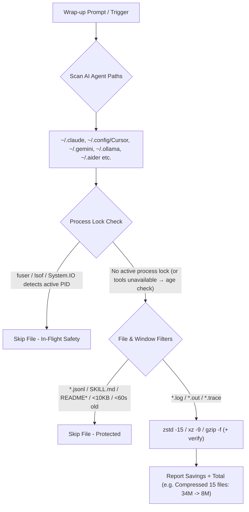

# zlog — Multi-Agent Session Log Storage Optimizer


<p align="center">
  <a href="https://agentskills.io"></a>
  <a href="https://skills.sh"></a>
  <a href="https://github.com/sebin-gg/zlog/actions"></a>
  <a href="LICENSE"></a>
  <a href="#compatibility"></a>
  <a href="https://github.com/sebin-gg/zlog/stargazers"></a>
</p>

> **The universal zero-config log compressor for AI agent developers.** Compresses session logs across Claude Code, Cursor, Gemini CLI, Ollama, Windsurf, Codex, Aider & LM Studio while keeping 100% of conversation transcripts intact. Run the Dry-Run preview for your own savings numbers.

---

## 🚀 Quick Install (1-Line)

### via `skills.sh` Package Manager
```bash
npx skills add sebin-gg/zlog
```

### via Shell Script
```bash
curl -fsSL https://raw.githubusercontent.com/sebin-gg/zlog/main/install.sh | bash
# Skill installed to ~/.agents/skills/zlog/SKILL.md — trigger in chat with: 'zlog', 'compress logs', or 'clean chat logs'.
```

> **What gets installed?** `install.sh` copies the whole skill (`SKILL.md`, `scripts/`, `references/`) to `~/.agents/skills/zlog/` (plus `~/.claude/skills/` / `~/.gemini/skills/` if those homes exist) so your AI agent can invoke `zlog` via chat. For terminal-only use with no install, run the bundled scripts directly (see Usage).

---

## ⚡ Key Highlights

- **High-Ratio Compression**: Tries `zstd -15`, falls back to `xz -9` / `gzip`. Reports per-run savings with a single summary line.
- **0-Byte Log Purging**: Cleans dead empty files automatically.
- **Process Lock Safe (best-effort)**: Checks kernel locks via `fuser -s` (Linux/WSL) or `lsof` (macOS), and `[System.IO.File]::Open` (Windows). If neither `fuser` nor `lsof` is available (minimal containers), safety falls back to a 60s age buffer — see FAQ.
- **Memory Context Intact**: Transcripts, configs, and live databases are excluded by filter (see `references/safety.md` data classes).
- **Single-Line Output**: Condenses multi-folder scan results into one clean line (`253M total`).
- **Cross-Platform Parity**: Runs natively on Linux, macOS, WSL, and Windows 11 PowerShell (with savings reporting on all platforms).
- **Junk-Pruned Hybrid Deep Scan**: Never descends into `Caches`/`node_modules`/GPU-cache junk or `.git`; capped at depth 12 — fast, future-proof, bounded. Compressed artifacts are verified before counting.

---

## 📊 Storage Savings

Savings depend on log content (repetitive text compresses best). Run the Dry-Run preview for your own numbers — the skill reports per-run raw → compressed totals.

---

## 🏗️ How It Works



---

## 🌐 Supported AI Agent Runtimes

| # | AI Agent / IDE | Default Log Directory | OS Parity |
| :---: | :--- | :--- | :--- |
| 1 | **Claude Code** | `~/.claude/` | Linux, Windows 11 |
| 2 | **Claude Code Config** | `~/.config/claude-code/` | Linux, Windows 11 |
| 3 | **Cursor IDE** | `~/.config/Cursor/` | Linux, Windows 11 |
| 4 | **Cursor (Legacy)** | `~/.cursor/` | Linux, Windows 11 |
| 5 | **Gemini CLI** | `~/.gemini/` | Linux, Windows 11 |
| 6 | **Gemini Antigravity** | `~/.gemini/antigravity/` (+ `antigravity-cli/logs/`) | Linux, Windows 11 |
| 7 | **Ollama** | `~/.ollama/` | Linux, Windows 11 |
| 8 | **Windsurf** | `~/.windsurf/` | Linux, Windows 11 |
| 9 | **Codex CLI** | `~/.codex/` | Linux, Windows 11 |
| 10 | **LM Studio** | `~/.cache/lm-studio/` (older) + `~/.lmstudio/` (current) | Linux, Windows 11 |
| 11 | **Aider** | `~/.aider/` | Linux, Windows 11 |

> **Note on Antigravity:** Antigravity stores logs under `~/.gemini/antigravity/` (and `~/.gemini/antigravity-cli/logs/`) — a Gemini CLI sub-component, not a standalone top-level agent. Both are covered automatically when scanning `~/.gemini/`.

## 💻 One-Line Command Snippets

> POSIX scans never follow symlinks (`find -P` default): symlinked dirs are not descended into and symlinked files are skipped, so scans stay inside the listed roots.

### POSIX Shell (Linux, macOS, WSL, Git Bash)

The implementation lives in `scripts/zlog.sh` — the skill runs it, and preview and cleanup share one candidate engine, so the preview never disagrees with cleanup:

```bash
bash scripts/zlog.sh preview               # read-only preview, changes nothing
bash scripts/zlog.sh clean                 # compress eligible logs
bash scripts/zlog.sh clean --older-than 7  # retention policy (days)
bash scripts/zlog.sh deep-preview          # read-only deep scan
bash scripts/zlog.sh deep                  # deep clean (explicit intent only)
bash scripts/zlog.sh restore file.log.zst  # restore an archive (archive kept)
```

> `*.txt` is intentionally excluded by default to avoid compressing config/docs/data files. See `references/safety.md` for the full data-class policy.

### Windows 11 PowerShell (tested on Windows 11)

The implementation lives in `scripts/zlog.ps1` (verified on stock PS 5.1):

```powershell
.\scripts\zlog.ps1 preview
.\scripts\zlog.ps1 clean
.\scripts\zlog.ps1 clean -OlderThanDays 7
.\scripts\zlog.ps1 deep-preview
.\scripts\zlog.ps1 deep
.\scripts\zlog.ps1 restore .\session.log.tar.gz
```

---

> Note: the Windows PowerShell scan recurses unpruned (PowerShell has no `-prune`) but applies the same junk-dir path-segment filter as the POSIX prune list; the find-based scans skip those dirs wholesale. It purges 0-byte logs first, then reports the same single-line summary. PowerShell path verified on Windows 11 (PS 5.1); POSIX paths are Linux-tested.

---
## 🎬 Demo

### Live Terminal Recording

```bash
# Record your own demo with asciinema (recommended)
asciinema rec zlog-demo.cast
# ... run: zlog / curl install / npx skills add ...
# Ctrl+D to stop
asciinema upload zlog-demo.cast
```

### Example Output (illustrative — exact numbers vary by machine)

```
[zlog] Compressed 1 file: 20.0K -> 12.7K (saved 7.3K, 36% smaller)
1.2G    total
```

The output is a single summary line: file count, raw → compressed, savings percentage, and total directory size.

### Record & Share

1. **Install asciinema**: `pipx install asciinema` / `brew install asciinema` / `choco install asciinema`
2. **Record**: `asciinema rec zlog-demo.cast`
3. **Run zlog**: trigger via your agent or run the one-liner
4. **Upload**: `asciinema upload zlog-demo.cast`
5. **Embed**: Paste the URL in issues, discussions, or social posts

---

## Compatibility

- **Linux**: Bash/Zsh snippets tested.
- **Windows 11**: PowerShell snippet verified on stock PS 5.1 (sandbox: compress/skip/purge/lock/junk/space-in-path).
- **macOS / WSL**: snippets ship with `stat -f` / `lsof` / Git Bash path fallbacks but are not runtime-tested here.

---

## ❓ FAQ

- **Does `zlog` break chat history?**  
  **No.** `transcript.jsonl` files are strictly excluded by filter.

- **What if an AI agent is actively writing to a log file?**  
  Kernel lock checks (`fuser -s` / `lsof` / `System.IO.File`) & 60s age buffer (`-mmin +1`) skip active files. The PowerShell lock check is verified on Windows 11; POSIX lock checks require `fuser` (Linux/WSL) or `lsof` (macOS) — without either only the age buffer protects.

- **How do I read or search compressed `.zst` / `.gz` logs?**  
  - Read: `zstdcat file.log.zst` or `zcat file.log.gz`
  - Read Windows `.tar.gz`: `tar -xzf file.log.tar.gz`
  - Search: `zstdgrep "error" file.log.zst` or `zgrep "error" file.log.gz`

- **Is `zlog` safe to run during multi-agent sessions?**  
  Best-effort only: lock checks + age filters skip files that are in use, but races remain possible. Prefer idle periods.

- **Why doesn’t `zlog` touch Codex `logs_2.sqlite`?**  
  SQLite/WAL stores (e.g. `~/.codex/sqlite/logs_2.sqlite`, observed at 32MB) are live databases — compressing them while open risks corruption. Intentionally out of scope; manage them via the app.

- **How does the deep scan stay bounded?**  
  Hybrid pruning + depth cap: junk/cache dirs (`node_modules`, `Caches`, `Code Cache`, `blob_storage`, `GPUCache`, `.git`, …) are pruned wholesale, while `-maxdepth 12` bounds the walk. The pruned-dir count is reported.

---

## 🌟 Support Open Source

If `zlog` saved space on your drive, consider giving it a **⭐ Star** on [GitHub](https://github.com/sebin-gg/zlog)!

---

## 📄 License

[MIT](LICENSE) © 2026 Sebin Mathew
