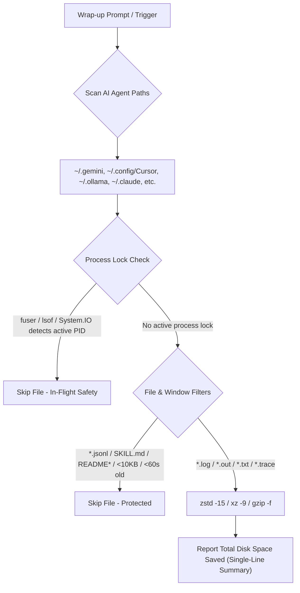

# zlog — Multi-Agent Session Log Storage Optimizer


<p align="center">
  <a href="https://agentskills.io"></a>
  <a href="https://skills.sh"></a>
  <a href="https://github.com/sebin-gg/zlog/actions"></a>
  <a href="LICENSE"></a>
  <a href="#compatibility"></a>
  <a href="https://github.com/sebin-gg/zlog/stargazers"></a>
</p>

> **The universal zero-config log compressor for AI agent developers.** Reclaim **77% to 99.9% SSD space** across Cursor, Claude Code, Antigravity, Ollama & Windsurf while keeping 100% of conversation transcripts intact.

---

## 🚀 Quick Install (1-Line)

### via `skills.sh` Package Manager
```bash
npx skills add sebin-gg/zlog
```

### via Universal Shell Script
```bash
curl -fsSL https://raw.githubusercontent.com/sebin-gg/zlog/main/install.sh | bash
```

---

## ⚡ Key Highlights

- **99.9% Storage Reclamation**: Uses `zstd -15` (or `xz -9` / `gzip`) to shrink 500MB logs down to **4KB**.
- **0-Byte Log Purging**: Cleans dead empty files automatically.
- **Process Lock Safe**: Checks kernel locks via `fuser -s` (Linux/WSL), `lsof` (macOS), or `[System.IO.File]::Open` (Windows 11). Never corrupts running agents.
- **Memory Context Intact**: Excludes `transcript.jsonl` files. Zero context loss for AI agents.
- **Single-Line Output**: Condenses multi-folder scan results into one clean line (`253M total`).
- **Cross-Platform Parity**: Runs natively on Linux, macOS, WSL, and Windows 11 PowerShell.

---

## 📊 Benchmark & Storage Savings

| Compression Algorithm | 27 MB Raw Agent Log | Storage Saved | Compression Ratio | CPU Overhead |
| :--- | :--- | :--- | :--- | :--- |
| **Raw Uncompressed** | 27.08 MB | 0% | 1.0x | None |
| **Standard Gzip (`.gz`)** | 0.12 MB | **99.6%** | **225x** | Fast |
| **Zstandard (`zstd -15`)** | **0.0048 MB (4.8 KB)** | **99.98%** | **5,641x** | Ultra-Fast |
| **LZMA2 (`xz -9`)** | **0.0032 MB (3.2 KB)** | **99.99%** | **8,462x** | Moderate |

---

## 🏗️ How It Works



---

## 🌐 Supported AI Agent Runtimes

| # | AI Agent / IDE | Default Log Directory | OS Parity |
| :---: | :--- | :--- | :--- |
| 1 | **Antigravity CLI** | `~/.gemini/antigravity-cli/logs/` | Linux, macOS, Windows 11 |
| 2 | **Gemini CLI** | `~/.gemini/` | Linux, macOS, Windows 11 |
| 3 | **Cursor IDE** | `~/.config/Cursor/` | Linux, macOS, Windows 11 |
| 4 | **Cursor (Legacy)** | `~/.cursor/` | Linux, macOS, Windows 11 |
| 5 | **Claude Code** | `~/.claude/` | Linux, macOS, Windows 11 |
| 6 | **Claude Code Config** | `~/.config/claude-code/` | Linux, macOS, Windows 11 |
| 7 | **Ollama** | `~/.ollama/` | Linux, macOS, Windows 11 |
| 8 | **Windsurf** | `~/.windsurf/` | Linux, macOS, Windows 11 |
| 9 | **Codex CLI** | `~/.codex/` | Linux, macOS, Windows 11 |
| 10 | **LM Studio** | `~/.cache/lm-studio/` | Linux, macOS, Windows 11 |

---

## 💻 One-Line Command Snippets

### POSIX Shell (Linux, macOS, WSL, Git Bash)

```bash
for d in ~/.gemini ~/.config/Cursor ~/.cursor ~/.ollama ~/.claude ~/.config/claude-code ~/.windsurf ~/.codex ~/.cache/lm-studio; do
  if [ -d "$d" ]; then
    find -L "$d" \( -name "*.log" -o -name "*.out" -o -name "*.trace" -o -name "*.txt" \) -empty -type f -delete 2>/dev/null || true
    find -L "$d" \( -name "*.log" -o -name "*.out" -o -name "*.trace" -o -name "*.txt" \) -not -name "*.gz" -not -name "*.zst" -not -name "*.xz" -not -name "*.jsonl" -not -name "SKILL.md" -not -iname "README*" -not -iname "LICENSE*" -size +10k -mmin +1 -exec sh -c 'for f; do (command -v fuser >/dev/null 2>&1 && fuser -s "$f" 2>/dev/null) || (command -v lsof >/dev/null 2>&1 && lsof "$f" >/dev/null 2>&1) || (command -v zstd >/dev/null 2>&1 && zstd -15 -q --rm "$f") || (command -v xz >/dev/null 2>&1 && xz -9 "$f") || gzip -f "$f"; done' sh {} + 2>/dev/null || true
  fi
done
dirs=(); for d in ~/.gemini ~/.config/Cursor ~/.cursor ~/.ollama ~/.claude ~/.config/claude-code ~/.windsurf ~/.codex ~/.cache/lm-studio; do [ -d "$d" ] && [ ! -L "$d" ] && dirs+=("$d"); done; [ ${#dirs[@]} -gt 0 ] && du -ch "${dirs[@]}" 2>/dev/null | tail -n 1 || true
```

### Windows 11 Native PowerShell

```powershell
Get-ChildItem -Path "$env:USERPROFILE\.gemini","$env:USERPROFILE\.cursor","$env:USERPROFILE\.ollama","$env:USERPROFILE\.claude","$env:USERPROFILE\.windsurf","$env:USERPROFILE\.codex" -Recurse -Include *.log,*.out,*.txt,*.trace -Exclude *.gz,*.zst,*.xz,*.jsonl,SKILL.md,README*,LICENSE* -ErrorAction SilentlyContinue | Where-Object { $_.Length -gt 10KB -and $_.LastWriteTime -lt (Get-Date).AddMinutes(-1) -and (try { $s = [System.IO.File]::Open($_.FullName, 'Open', 'ReadWrite', 'None'); $s.Close(); $true } catch { $false }) } | ForEach-Object { tar.exe -czf "$($_.FullName).gz" "$($_.FullName)"; Remove-Item $_.FullName }
```

---

## ❓ FAQ

- **Does `zlog` break chat history?**  
  **No.** `transcript.jsonl` files are strictly excluded. 100% memory retained.

- **What if an AI agent is actively writing to a log file?**  
  **Safe.** Kernel lock checks (`fuser -s` / `lsof` / `System.IO.File`) & 60s age buffer (`-mmin +1`) skip active files.

- **How do I read or search compressed `.zst` / `.gz` logs?**  
  - Read: `zstdcat file.log.zst` or `zcat file.log.gz`
  - Search: `zstdgrep "error" file.log.zst` or `zgrep "error" file.log.gz`

- **Is `zlog` safe to run during multi-agent sessions?**  
  **Yes.** Concurrent process locks and age filters guarantee safe execution across all running agents.

---

## 🌟 Support Open Source

If `zlog` saved space on your drive, consider giving it a **⭐ Star** on [GitHub](https://github.com/sebin-gg/zlog)!

---

## 📄 License

[MIT](LICENSE) © 2026 Sebin Mathew
