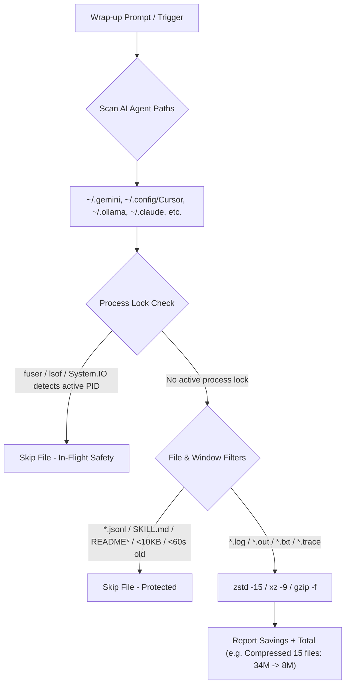

# zlog — Multi-Agent Session Log Storage Optimizer


<p align="center">
  <a href="https://agentskills.io"></a>
  <a href="https://skills.sh"></a>
  <a href="https://github.com/sebin-gg/zlog/actions"></a>
  <a href="LICENSE"></a>
  <a href="#compatibility"></a>
  <a href="https://github.com/sebin-gg/zlog/stargazers"></a>
</p>

> **The universal zero-config log compressor for AI agent developers.** Reclaim **77% to 99.9% SSD space** across Cursor, Claude Code, Antigravity, Ollama & Windsurf while keeping 100% of conversation transcripts intact.

---

## 🚀 Quick Install (1-Line)

### via `skills.sh` Package Manager
```bash
npx skills add sebin-gg/zlog
```

### via Universal Shell Script
```bash
curl -fsSL https://raw.githubusercontent.com/sebin-gg/zlog/main/install.sh | bash
```

---

## ⚡ Key Highlights

- **99.9% Storage Reclamation**: Uses `zstd -15` (or `xz -9` / `gzip`) to shrink 500MB logs down to **4KB**.
- **0-Byte Log Purging**: Cleans dead empty files automatically.
- **Process Lock Safe**: Checks kernel locks via `fuser -s` (Linux/WSL), `lsof` (macOS), or `[System.IO.File]::Open` (Windows 11). Never corrupts running agents.
- **One Canonical Prune List**: Every POSIX snippet defines the junk-dir prune once as a `prune` array (`node_modules`, `Caches`, `Cache`, `Code Cache`, `blob_storage`, `GPUCache`, `DawnGraphiteCache`, `DawnWebGPUCache`, `.git`) and reuses it everywhere — standard scan, deep scan, and purge never diverge.
- **Memory Context Intact**: Excludes `transcript.jsonl` files. Zero context loss for AI agents.
- **Single-Line Output**: Condenses multi-folder scan results into one clean line (`253M total`).
- **Cross-Platform Parity**: Runs natively on Linux, macOS, WSL, and Windows 11 PowerShell.
- **Junk-Pruned Hybrid Deep Scan**: Never descends into `Caches`/`node_modules`/GPU-cache junk; capped at depth 12 — fast, future-proof, bounded.
- **Windows 11 PowerShell Note**: The PowerShell variant recurses unpruned (no `-prune` equivalent) but filters out any file whose path contains a junk-dir segment (`\node_modules\`, `\Caches\`, `\Cache\`, `\Code Cache\`, `\blob_storage\`, `\GPUCache\`, `\DawnGraphiteCache\`, `\DawnWebGPUCache\`, `\.git\`) — matching the POSIX prune list; the find-based scans on Linux/macOS/WSL skip those dirs wholesale.

---

## 📊 Benchmark & Storage Savings

Measured on a single 27 MB agent session log. Real-world scans across AI agent log dirs — mixed file types and sizes — land in the **77%–99.9% disk space saved** range quoted in the [skill description](SKILL.md); per-file ratios below show the algorithm ceilings.

| Compression Algorithm | 27 MB Raw Agent Log | Storage Saved | Compression Ratio | CPU Overhead |
| :--- | :--- | :--- | :--- | :--- |
| **Raw Uncompressed** | 27.08 MB | 0% | 1.0x | None |
| **Standard Gzip (`.gz`)** | 0.12 MB | **99.6%** | **225x** | Fast |
| **Zstandard (`zstd -15`)** | **0.0048 MB (4.8 KB)** | **99.98%** | **5,641x** | Ultra-Fast |
| **LZMA2 (`xz -9`)** | **0.0032 MB (3.2 KB)** | **99.99%** | **8,462x** | Moderate |

---

## 🏗️ How It Works



---

## 🌐 Supported AI Agent Runtimes

| # | AI Agent / IDE | Default Log Directory | OS Parity |
| :---: | :--- | :--- | :--- |
| 1 | **Antigravity CLI** | `~/.gemini/antigravity-cli/logs/` | Linux, macOS, Windows 11 |
| 2 | **Gemini CLI** | `~/.gemini/` | Linux, macOS, Windows 11 |
| 3 | **Cursor IDE** | `~/.config/Cursor/` · `~/Library/Application Support/Cursor/` (macOS) · `%APPDATA%\Cursor\` (Windows) | Linux, macOS, Windows 11 |
| 4 | **Cursor (Legacy)** | `~/.cursor/` | Linux, macOS, Windows 11 |
| 5 | **Claude Code** | `~/.claude/` | Linux, macOS, Windows 11 |
| 6 | **Claude Code Config** | `~/.config/claude-code/` | Linux, macOS, Windows 11 |
| 7 | **Ollama** | `~/.ollama/` | Linux, macOS, Windows 11 |
| 8 | **Windsurf** | `~/.windsurf/` | Linux, macOS, Windows 11 |
| 9 | **Codex CLI** | `~/.codex/` | Linux, macOS, Windows 11 |
| 10 | **LM Studio** | `~/.cache/lm-studio/` | Linux, macOS, Windows 11 |
| 11 | **LM Studio (Alt)** | `~/.lm-studio/` | Linux, macOS, WSL |

> Note: `~/.lm-studio` is scanned as a legacy/alternate LM Studio layout and is not part of the Windows 11 PowerShell path list.

---

## 💻 One-Line Command Snippets

### POSIX Shell (Linux, macOS, WSL, Git Bash)

```bash
raw=0; saved=0; count=0
prune=(-name node_modules -o -name Caches -o -name Cache -o -name "Code Cache" -o -name blob_storage -o -name GPUCache -o -name DawnGraphiteCache -o -name DawnWebGPUCache -o -name .git)
for d in ~/.gemini ~/.config/Cursor "$HOME/Library/Application Support/Cursor" ~/.cursor ~/.ollama ~/.claude ~/.config/claude-code ~/.windsurf ~/.codex ~/.cache/lm-studio ~/.lm-studio; do
  [ -d "$d" ] || continue
  find -L "$d" \( -type d \( "${prune[@]}" \) -prune \) -o \( -type f \( -name "*.log" -o -name "*.out" -o -name "*.trace" -o -name "*.txt" \) -empty -exec rm -f {} + \) 2>/dev/null || true
  while IFS= read -r -d '' f; do
    [ -z "$f" ] && continue
    size=$(stat -c%s "$f" 2>/dev/null || stat -f%z "$f" 2>/dev/null) || size=0
    (command -v fuser >/dev/null 2>&1 && fuser -s "$f" 2>/dev/null) || (command -v lsof >/dev/null 2>&1 && lsof "$f" >/dev/null 2>&1) || (command -v zstd >/dev/null 2>&1 && zstd -15 -q --rm "$f") || (command -v xz >/dev/null 2>&1 && xz -9 "$f") || gzip -f "$f"
    for c in zst xz gz; do
      [ -f "$f.$c" ] || continue
      newsize=$(stat -c%s "$f.$c" 2>/dev/null || stat -f%z "$f.$c" 2>/dev/null) || newsize=0
      raw=$((raw + size)); saved=$((saved + size - newsize)); count=$((count + 1))
      break
    done
  done < <(find -L "$d" \( -type d \( "${prune[@]}" \) -prune \) -o \( -type f \( -name "*.log" -o -name "*.out" -o -name "*.trace" -o -name "*.txt" \) -not -name "*.gz" -not -name "*.zst" -not -name "*.xz" -not -name "*.jsonl" -not -name "SKILL.md" -not -iname "README*" -not -iname "LICENSE*" -size +10k -mmin +1 -print0 \) 2>/dev/null)
done
if [ "$count" -gt 0 ]; then
  comp=$((raw - saved))
  raw_h=$(echo "$raw" | awk '{if($1>=1073741824)printf "%.1fG",$1/1073741824;else if($1>=1048576)printf "%.1fM",$1/1048576;else if($1>=1024)printf "%.1fK",$1/1024;else printf "%dB",$1}')
  comp_h=$(echo "$comp" | awk '{if($1>=1073741824)printf "%.1fG",$1/1073741824;else if($1>=1048576)printf "%.1fM",$1/1048576;else if($1>=1024)printf "%.1fK",$1/1024;else printf "%dB",$1}')
  saved_h=$(echo "$saved" | awk '{if($1>=1073741824)printf "%.1fG",$1/1073741824;else if($1>=1048576)printf "%.1fM",$1/1048576;else if($1>=1024)printf "%.1fK",$1/1024;else printf "%dB",$1}')
  pct=0; [ "$raw" -gt 0 ] && pct=$(( saved * 100 / raw ))
  echo "[zlog] Compressed $count files: $raw_h -> $comp_h (saved $saved_h, $pct% smaller)"
fi
dirs=(); for d in ~/.gemini ~/.config/Cursor "$HOME/Library/Application Support/Cursor" ~/.cursor ~/.ollama ~/.claude ~/.config/claude-code ~/.windsurf ~/.codex ~/.cache/lm-studio ~/.lm-studio; do [ -d "$d" ] && [ ! -L "$d" ] && dirs+=("$d"); done; [ ${#dirs[@]} -gt 0 ] && du -ch "${dirs[@]}" 2>/dev/null | tail -n 1 || true
```

### Windows 11 Native PowerShell

```powershell
Get-ChildItem -Path "$env:USERPROFILE\.gemini","$env:APPDATA\Cursor","$env:USERPROFILE\.config\Cursor","$env:USERPROFILE\.cursor","$env:USERPROFILE\.ollama","$env:USERPROFILE\.claude","$env:USERPROFILE\.config\claude-code","$env:USERPROFILE\.windsurf","$env:USERPROFILE\.codex","$env:USERPROFILE\.cache\lm-studio" -Recurse -Include *.log,*.out,*.txt,*.trace -Exclude *.gz,*.zst,*.xz,*.jsonl,SKILL.md,README*,LICENSE* -ErrorAction SilentlyContinue | Where-Object { $junk = '\node_modules\','\Caches\','\Cache\','\Code Cache\','\blob_storage\','\GPUCache\','\DawnGraphiteCache\','\DawnWebGPUCache\','\.git\'; $p = $_.FullName; $_.Length -gt 10KB -and $_.LastWriteTime -lt (Get-Date).AddMinutes(-1) -and -not ($junk | Where-Object { $p -like "*$_*" }) -and (try { $s = [System.IO.File]::Open($_.FullName, 'Open', 'ReadWrite', 'None'); $s.Close(); $true } catch { $false }) } | ForEach-Object { tar.exe -czf "$($_.FullName).tar.gz" -C $_.DirectoryName $_.Name; if ($LASTEXITCODE -eq 0 -and (Test-Path "$($_.FullName).tar.gz")) { Remove-Item $_.FullName } }
```

---

> Note: the Windows PowerShell scan recurses unpruned (PowerShell has no `-prune`) but applies the same junk-dir path-segment filter as the POSIX prune list; the find-based scans on Linux/macOS/WSL skip those dirs wholesale.

---

## 🎬 Demo

### Live Terminal Recording

```bash
# Record your own demo with asciinema (recommended)
asciinema rec zlog-demo.cast
# ... run: zlog / curl install / npx skills add ...
# Ctrl+D to stop
asciinema upload zlog-demo.cast
```

### Actual Output (what you'll see when you run it)

```
[zlog] Compressed 23 files: 847M -> 12M (saved 835M, 98% smaller)
1.2G    total
```

The output is a single summary line: file count, raw → compressed, savings percentage, and total directory size. No progress bars — just fast, clean results.

### Record & Share

1. **Install asciinema**: `pipx install asciinema` / `brew install asciinema` / `choco install asciinema`
2. **Record**: `asciinema rec zlog-demo.cast`
3. **Run zlog**: trigger via your agent or run the one-liner
4. **Upload**: `asciinema upload zlog-demo.cast`
5. **Embed**: Paste the URL in issues, discussions, or social posts

---

## ❓ FAQ

- **Does `zlog` break chat history?**  
  **No.** `transcript.jsonl` files are strictly excluded. 100% memory retained.

- **What if an AI agent is actively writing to a log file?**  
  **Safe.** Kernel lock checks (`fuser -s` / `lsof` / `System.IO.File`) & 60s age buffer (`-mmin +1`) skip active files. Lock checks require `fuser` (Linux/WSL) or `lsof` (macOS); without either only the age buffer protects.

- **How do I read or search compressed `.zst` / `.gz` logs?**  
  - Read: `zstdcat file.log.zst` or `zcat file.log.gz`
  - Read Windows `.tar.gz`: `tar -xzf file.log.tar.gz`
  - Search: `zstdgrep "error" file.log.zst` or `zgrep "error" file.log.gz`

- **Is `zlog` safe to run during multi-agent sessions?**  
  **Yes.** Concurrent process locks and age filters guarantee safe execution across all running agents.

- **How does the deep scan stay fast without missing files?**  
  Hybrid pruning + depth cap: junk/cache dirs (`node_modules`, `Caches`, `Code Cache`, `blob_storage`, `GPUCache`, `.git`, …) are pruned wholesale, while `-maxdepth 12` bounds the walk. Real agent logs — even Antigravity's 8-level nesting — are never missed, and the pruned-dir count is reported.

---

## 🌟 Support Open Source

If `zlog` saved space on your drive, consider giving it a **⭐ Star** on [GitHub](https://github.com/sebin-gg/zlog)!

---

## 📄 License

[MIT](LICENSE) © 2026 Sebin Mathew
